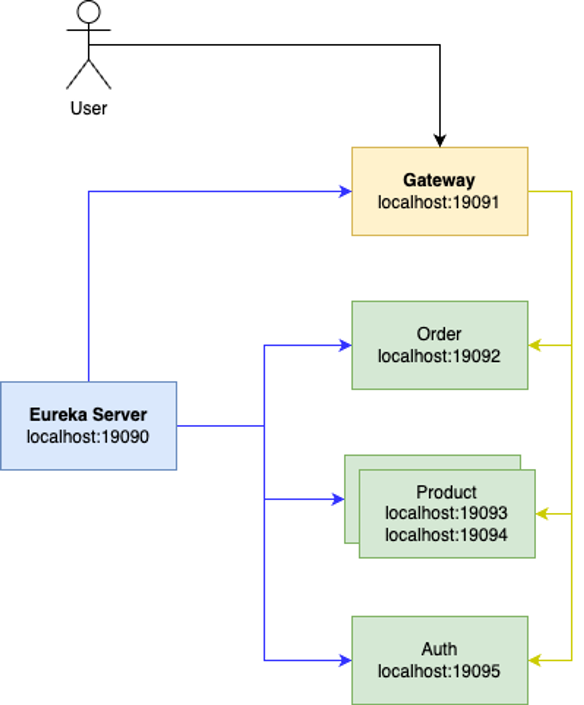

## Spring 심화 Chapter1 과제
> 24.08.06 ~ 24.08.12

### Goal
- MSA 구성
- Redis 캐싱
- Docker 기반 CI/CD 구성하기

### File Structure
```java
├── README.md
├── client
│   ├── auth
│   ├── gateway
│   ├── order
│   └── product
└── server
```

### System Architecture

